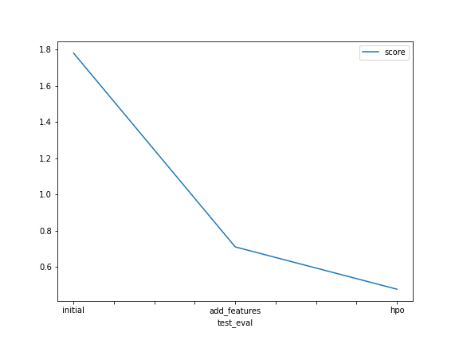

# Report: Predict Bike Sharing Demand with AutoGluon Solution
#### NAME HERE

## Initial Training
### What did you realize when you tried to submit your predictions? What changes were needed to the output of the predictor to submit your results?
The require parse datetime make me feel confused, so I tried research to fine the anwser and finally, I solved it. Additional, I could not install environment in Sagemaker, I had to using local to practice. 

### What was the top ranked model that performed?
The best model that I achieved have score is 0.47556. I fine-tuned hyparameter and it give better result.

## Exploratory data analysis and feature creation
### What did the exploratory analysis find and how did you add additional features?
When I plot diagrams of all feature, I can see different in weather, temp and windspeed. I parsed datetime column into four columns (year, month, day, hour). And it improve model well.
### How much better did your model preform after adding additional features and why do you think that is?
It improve score from 1.78140 into 0.70946. About 42% 

## Hyper parameter tuning
### How much better did your model preform after trying different hyper parameters?
After trying different hyper parameters, the result was so much better. From ~0.7 into 0.47 (score) 
### If you were given more time with this dataset, where do you think you would spend more time?
I think I will focus on analyzing for seasons and working day columns.

### Create a table with the models you ran, the hyperparameters modified, and the kaggle score.
	model	hpo1	hpo2	hpo3	score
	initial	default	default	default	1.78140
	add_features	Handle datetime	Add 4 new feature [year,month,day,hour]	None	0.70946
	hpo	multimodal	local scheduler	None	0.47556
### Create a line plot showing the top model score for the three (or more) training runs during the project.

 

### Create a line plot showing the top kaggle score for the three (or more) prediction submissions during the project.

 

## Summary
The project give me a good view to analyze data and how to way handle structure data before training. Finally, fine-tune hyper-parameter is one of steps important to improve model that we need to focus.
